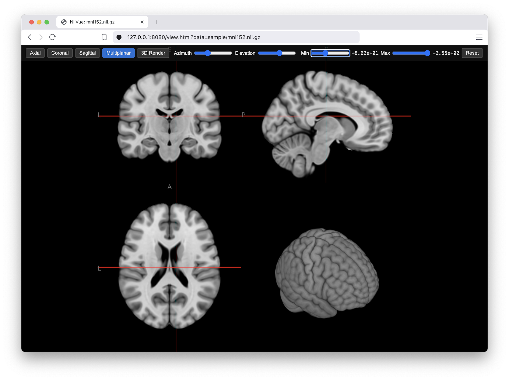

# Niftier Viewer



A small [NiiVue](https://niivue.com/) viewer, with slice/3D render controls
and interactive intensity thresholding.

## Quickstart

Start the application:
```
make run DATA=sample/mni152.nii.gz
```

Then open [`http://127.0.0.1:8080/view.html?data=sample/mni152.nii.gz`](http://127.0.0.1:8080/view.html?data=sample/mni152.nii.gz)

## Usage

1. Put your volume at `data/volume.nii.gz` (gitignored — not checked in), or
   use any other path via `DATA`, e.g. `data/my_volume.nii.gz`. No data of
   your own? `make install && make run DATA=sample/mni152.nii.gz` loads the
   small human MRI template checked into `sample/` (see `sample/NOTICE.md`
   for license/attribution).
2. `make install`
3. `make run` (or `make run DATA=data/my_volume.nii.gz`), then open the
   URL it prints — the `?data=...` in it is required; `view.html` alone
   won't load a volume. Change that query param to switch files without
   restarting the server.

## Threshold previews

Dragging the min/max threshold sliders against the full-res volume is slow,
because NiiVue rebuilds the entire GPU texture on every update. To keep
dragging smooth, `make run` also builds a downsampled preview volume next to
the source (`data/volume_lowres.nii.gz`, see `scripts/make_lowres.py`) that's
swapped in while a slider is held and swapped back to full-res on release.

The downsample factor defaults to 3x per axis (27x fewer voxels) and can be
overridden, e.g. `make run LOWRES_FACTOR=4`.
